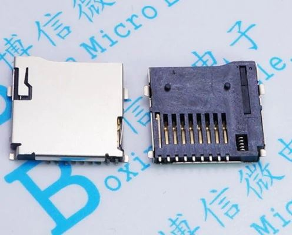
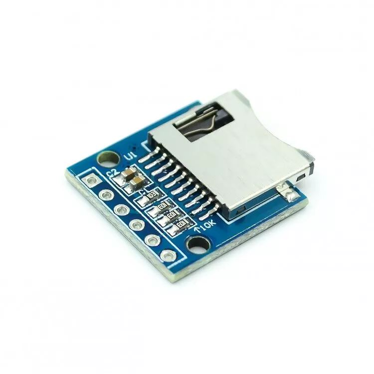
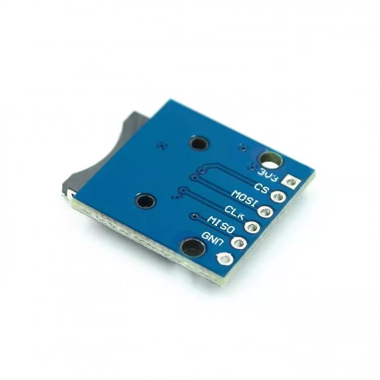
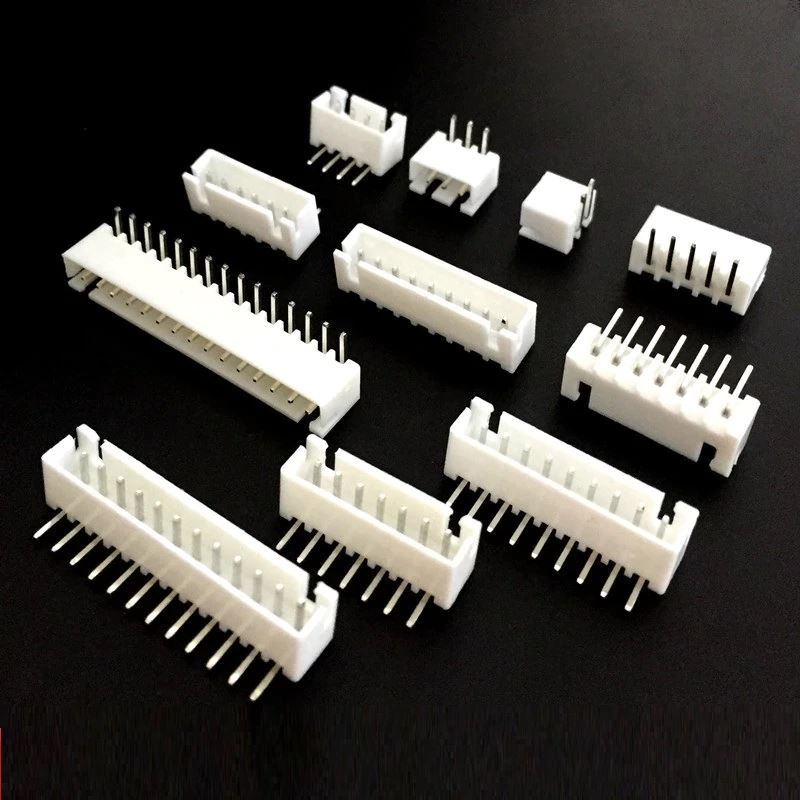
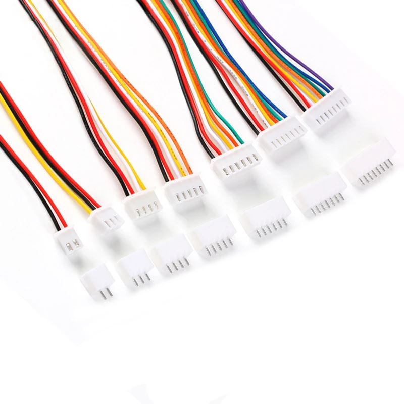

# Hardware Component Choices and Assembly

[Interactive Bill of Materials (BOM)](ibom.html)

### Devkit Board

Espressif ESP32-DevKitC-VE is the recommended choice. They are pretty much $11 everywhere, so I just used [Amazon](https://www.amazon.com/gp/product/B087TNPQCV).  I like to mount mine on [female headers](https://www.aliexpress.com/item/32724478308.html) so they can be easily removed and/or reused in other projects.

### Micro SD Card Connector

This can be either the commonly available push-push [connector](https://www.aliexpress.com/item/4001278357176.html) with locating pins from Aliexpress, eBay, LCSC, etc.

Or a push-pull [break out board](https://www.aliexpress.com/item/32886674838.html) mounted via the J3 header pins from the same Chinese suppliers.

Yes, the first option is SMD and not THT, but it's pretty easy to solder and gives a cleaner build IMHO so I added it as an option.  When using the SMD connector you also need to populate the pull-up resistors R10 thru R13.  The break out board already has these mounted.

### Cable Connector

You can use either J1 to mount any standard 12 position (12p) 2.54mm type header connector or use J10 to mount a female DB15 connector. If you want something keyed to prevent reverse insertion I would recommend right angle [XH2.54 style connectors](https://www.aliexpress.com/item/32823261625.html).

You can also buy prewired 12p [XH2.54 cables](https://www.aliexpress.com/item/1005001463221962.html) if you don't want to crimp your own.

When wiring J1 skip pin 12 (the +12V line on old 400/800's) from the SIO connector and wire SIO pin 13 to pin 12 on J1.  When using J10 wire pin for pin, but pin 12 is not connected on the PCB so you don't really need to wire it.

For the SIO plug on the Atari side, I've had great luck using this 3D printed model, [https://www.thingiverse.com/thing:2883606/files](https://www.thingiverse.com/thing:2883606/files), and KK 396 style crimp connectors.

### Bulk Capacitors

C4 and C5 are bulk storage capacitors for the 3.3V (SD card) and 5V lines.  They are optional since the devkit board already has caps on-board, but if you have a marginal SIO 5V line or experience other power issues, they could help stabilize the overall board.  Any value between 10uf to 47uf is fine.

### Resistors

Either 1/4W or 1/8W can be used in all locations except the pull-ups on the SD card.

R1, R2, and R3 control the LED brightness. The values listed are the same as the SIO mounted Fujinet, but you may want to pick other values if using different LED's with different [Vf](https://electronics.stackexchange.com/questions/173468/easy-way-to-figure-out-a-leds-vf-in-order-to-pick-an-appropriate-resistor) values or prefer brighter or dimmer LEDs.  I generally shoot for around 1ma to 2ma of current on a standard 20ma LED depending on color.  Remember, these are being driven by 3.3V, not the normal 5V you may see on an AVR Arduino project.  A good calculator is at:

[http://ledcalc.com/](http://ledcalc.com/)

R14 and R15 are optional.  They form a voltage divider than is only used these days to show SIO voltage in the FujiNet web interface.

### Diode D4

This is to prevent back feeding of the SIO 5V line if you also plug the devkit board into USB while connected to your Atari. If you are 100% certain you will never do this, you can simply bridge this connection.  Or leave it off completely and only power your FujiNet via USB.  A 1N5817 is the recommended value here, but others like a 1N5819 will also work, just with a slightly higher voltage drop.

### External Headers

If you plan on mounting your FujiNet in a larger enclosure, you can use J2, J4, J5, J6, J7, and J8 instead of the PCB mounted buttons and LEDs.

 

