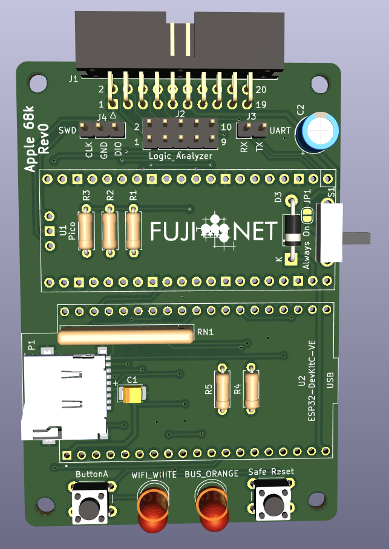
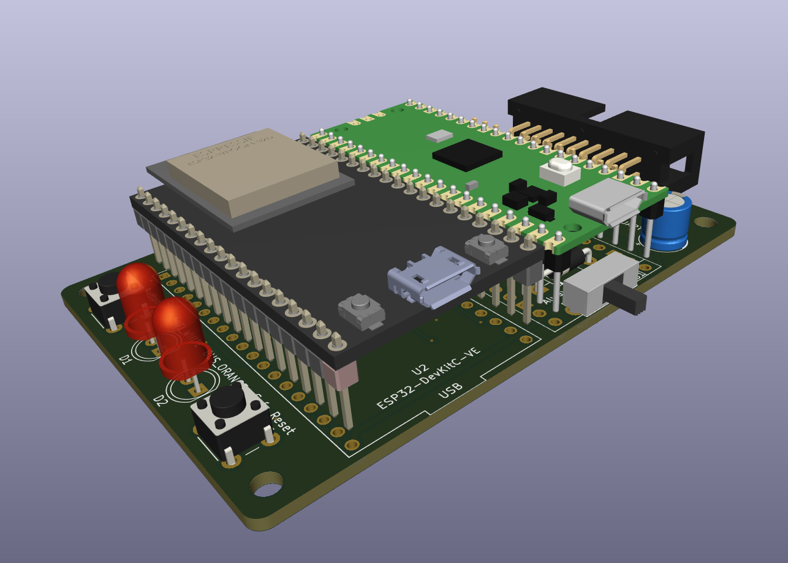

Note, this is an **early prototype** for Apple 68k Macs.

Design sourced from []https://github.com/djtersteegc/Apple-68k-FujiNet](https://github.com/djtersteegc/Apple-68k-FujiNet)

# Rev0

Schematic - https://djtersteegc.github.io/Apple-68k-FujiNet/Apple-68k-FujiNet-Rev0-Schematic.pdf

Interactive BOM - https://djtersteegc.github.io/Apple-68k-FujiNet/ibom-Rev0.html

C1 and C2 can be considered optional, board should work without them.

You'll need 8.5mm high [2.54mm female header strips](https://www.aliexpress.us/item/2251832416528370.html) to mount the ESP32 and Pi Pico.  Buy the 1x40 versions and cut to length.

The switch controls power from the Mac DB19 port. Can be bridged via JP1 if you don't want to install and always be powered. The footprint also takes the common [**12D07VG4**](https://www.aliexpress.us/item/2255801015765871.html) you find on AliExpress.

MicroSD socket footprint is the common [Chinese push-push version](https://www.aliexpress.us/item/2251832613969983.html) used on all the FujiNet's to date.

