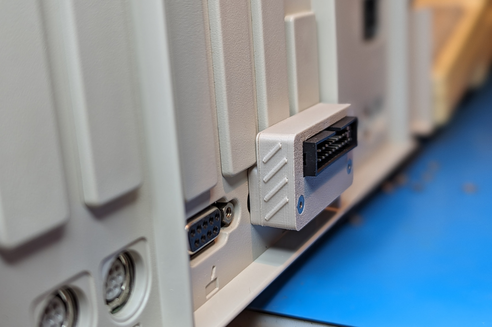
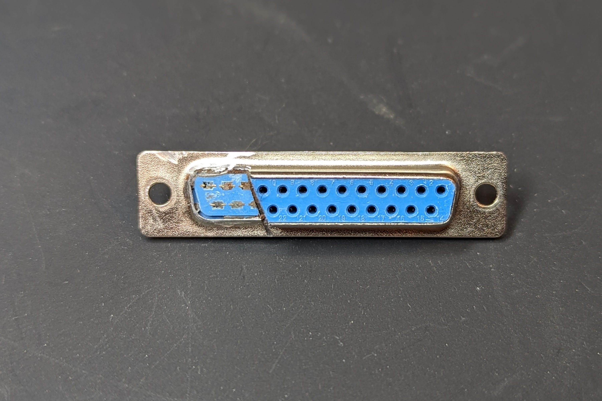

A DB19 to IDC-20 adapter for use with Rev1 Devkit FujiApple boards, or Rev0 MacFuji boards.  Uses cheap DB pins originally intended to be soldered on the end of wires and is housed in a 3D printed case.

[Schematic](db19-to-idc20-schematic.pdf)

# BOM

IDC-20 2.54mm 2x10 Male Box Header - https://www.aliexpress.us/item/3256806042421204.html

DB 1.0mm pins, Wires Solder Model - https://www.aliexpress.us/item/3256802431271655.html

M2.5 Nuts - https://www.aliexpress.us/item/2255800799473326.html

M2.5x16mm Countersunk Screws - https://www.aliexpress.us/item/2251832747871730.html

# Case

The case parts are designed to printed at a 0.2mm layer height. There are two different DB19 connector options for the case.

One is a flat back that IMHO looks better but only works on an Apple IIc or IIc+. 

The other is a stepped back that provides the clearance needed to sit flush on a IIgs or compact Mac model.

# Solder Jumpers

**-12V** - Routes -12V to pin 9

**12V** - Routes +12V to pins 13, 15, and 19

**PIN17** - Routes either the Drive2 signal or +12V to pin 17

# Assembly

First solder on the IDC-20 connector with the keying notch matched to the silkscreen.

**If using with a Rev1 FujiApple close the PIN17 solder jumper to Drive2.**

Cleanup you 3D printed DB19 connector by using a 1mm and 2mm drill bit to size the DB pin holes.

Press some M2.5 nuts into the DB19 connector, place it on a female DB19, or cut down female DB25, connector and then insert the 19 DB pins with the tube cut facing outwards to enable easier soldering access.

Then slide the PCB into the case and work it over the DB pins.  I like to temporarily screw the PCB/case to the DB19 connector with some M2.5x10mm nylon screws (they have a very small head) and clamp the whole assembly in a vise for soldering.  The ends of the tube cuts in the DB19 pins should be flush with the top of the PCB.

Finally assemble the case lid with two M2.5x16mm screws.