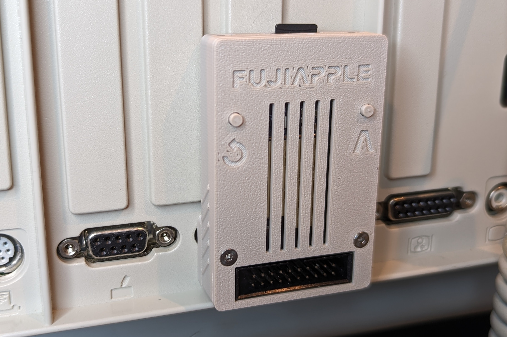
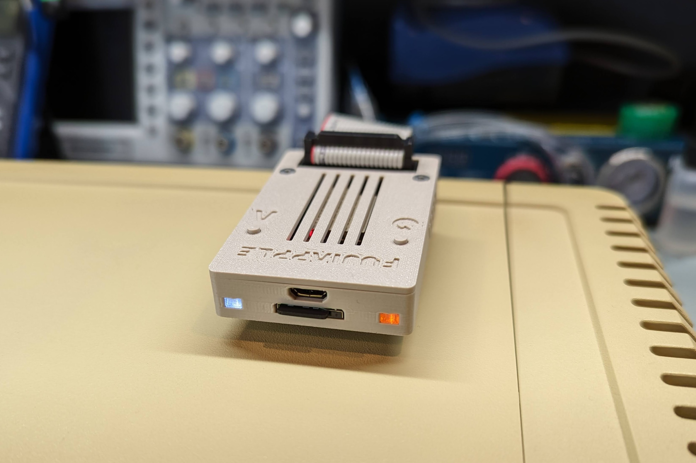
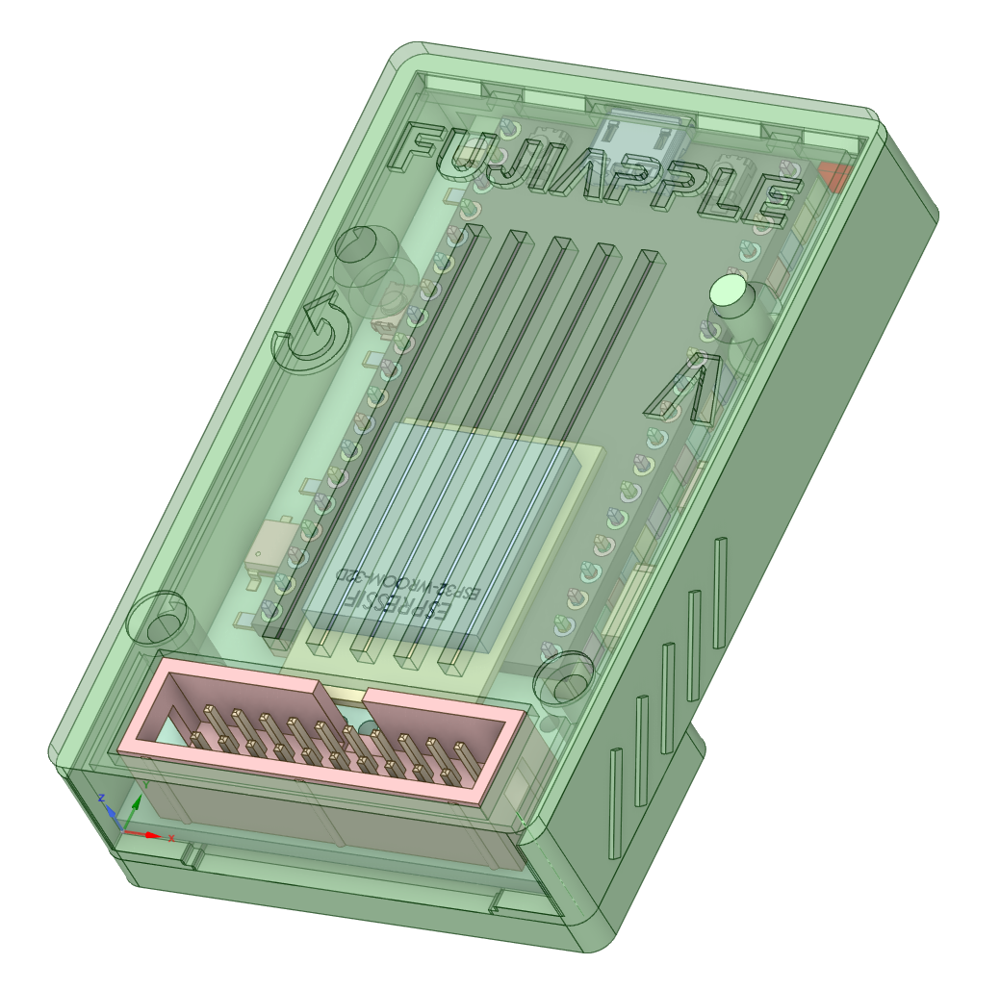
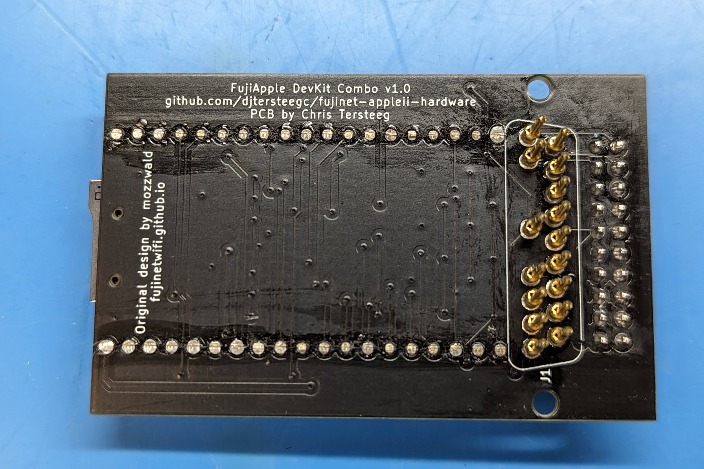

This is built primary to work in DB19 mode, but can also be used with the DB19 Male Adapter to plug into a IDC-20 disk card. I tend to build them in the short configuration to keep the case height as slim as possible when plugged in the Apple II. The downside of this is once you solder the ESP32 to the board, you will not be able to access the components under it for troubleshooting.

[Schematic](https://djtersteegc.github.io/fujinet-hardware/AppleII/Schematic-DevKit-Combo-v1.0.pdf)

# BOM

There's an interactive BOM [here](https://djtersteegc.github.io/fujinet-hardware/AppleII/ibom-DevKit-Combo-v1.0.html), and CSV version with footprint info [here](https://djtersteegc.github.io/fujinet-hardware/AppleII/bom-DevKit-Combo-v1.0.csv). The interactive one is super useful when placing the SMD components.

The DB19 connector uses 16 of the wire solder style pins from this seller on AliExpress - https://www.aliexpress.us/item/3256802431271655.html

If building in the tall configuration you will also need two 19p 2.54mm female header strips. I buy the the [40p versions](https://www.aliexpress.us/item/3256805857141565.html) and cut them down to size.

Make sure to buy the ESP32-DEVKITC-VE version of the devkit board.  If you are in the US, [Amazon](https://www.amazon.com/gp/product/B087TNPQCV) is a great place to pick one of these up with Prime shipping.

The MicroSD sockets are readily available from [AliExpress](https://www.aliexpress.us/item/3256802476596462.html), [Amazon](https://www.amazon.com/Spring-Loaded-Transflash-Memory-Socket/dp/B0CDC5Q1HF), eBay and other places, sometimes called _Push Push TransFlash Socket_.

The "standard" FujiNet LED's colors are white for Wifi and orange for bus activity.

The case requires two M2.5x16mm countersunk screws and two M2.5 hex nuts.

Buying everything in quantity 10 from someplace like AliExpress will be much cheaper, especially if you plan on doing multiple builds. But here's a Mouser shared project that includes everything but the DB19 connector pins -  https://www.mouser.com/ProjectManager/ProjectDetail.aspx?AccessID=C40F378B5C

# Case

Designed to be printed at a 0.2mm layer height. Use Polymaker PolyTerra Matte PLA in Muted White (Hex Code: #Bfbcb1) for a good match to Apple Platinum.

There are two rectangular lightpipes to be printed in clear filament. If you find the standard one fits to losely in the opening, print a pair of the "tight" versions which a slightly bigger.

Assemble with two M2.5x16mm countersunk screws and two M2.5 hex nuts.

# Assembly

Solder on all the SMD components.  I use solder paste hand applied with a pneumatic dispenser and then finish on a hot plate. But you can also hand solder, use hot air, or even order a stencil for paste application and use a proper reflow oven.

If building in the short configuration, double check all your solder joints on the MicroSD socket and buffers since once you solder on the ESP32, you will lose access to the all the components under it.

Next solder on the IDC-20 connector.

Before mounting the ESP32, you will need to solder on the DB19 pins.  Some of these pics are from the DB19 adapter build, but the process is the same.

Cleanup you 3D printed DB19 connector by using a 1mm and 2mm drill bit to size the DB pin holes.

Press some M2.5 nuts into the DB19 connector, place it on a female DB19, or cut down female DB25, connector and then insert the 19 DB pins with the tube cut facing forward away from the IDC-20 connector to enable easier soldering access.

Then slide the PCB into the case and work it over the DB pins.  I like to temporarily screw the PCB/case to the DB19 connector with some M2.5x10mm nylon screws (they have a very small head) and clamp the whole assembly in a vise for soldering.  The ends of the tube cuts in the DB19 pins should be flush with the top of the PCB.

Now you can solder on the ESP32.  Once complete you will need to trim the pins to allow the PCB to slide back in the case.

Insert the two lightpipes with the lip facing up, slide the PCB under them, and then secure the case lid with two M2.5x16mm screws.

# Flashing

Use the standard Apple II firmware in the [FujiNet Flasher](https://fujinet.online/download/)