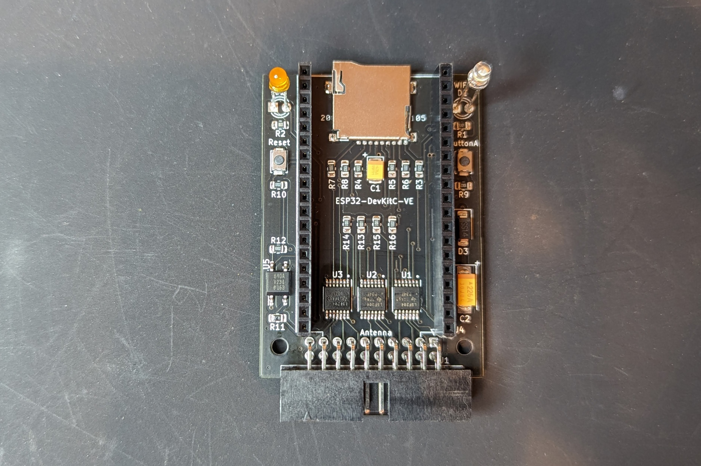
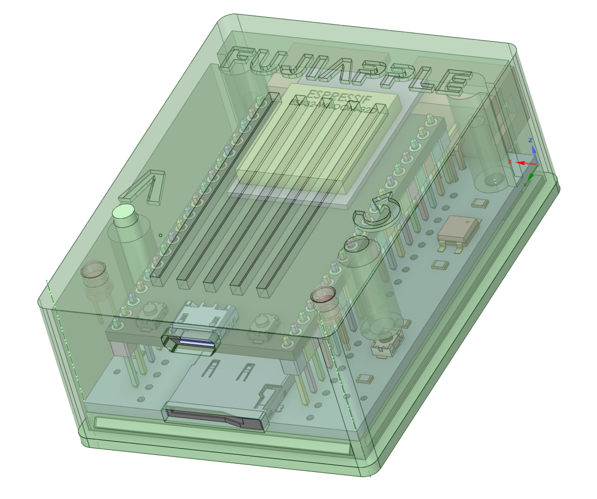

This is the easiest to build of the Devkit series.  It is built with 8.5mm high female headers allowing for easy removal of the ESP32 board to troubleshoot soldering issues with components placed under it.

[Schematic](https://djtersteegc.github.io/fujinet-hardware/AppleII/Schematic-DevKit-IDC-20-v1.0.pdf)

# BOM

There's an interactive BOM [here](https://djtersteegc.github.io/fujinet-hardware/AppleII/ibom-DevKit-IDC-20-v1.0.html), and CSV version with footprint info [here](https://djtersteegc.github.io/fujinet-hardware/AppleII/bom-DevKit-IDC-20-v1.0.csv). The interactive one is super useful when placing the SMD components.

You will also need two 19p 2.54mm female header strips. I buy the the [40p versions](https://www.aliexpress.us/item/3256805857141565.html) and cut them down to size.

Make sure to buy the ESP32-DEVKITC-VE version of the devkit board.  If you are in the US, [Amazon](https://www.amazon.com/gp/product/B087TNPQCV) is a great place to pick one of these up with Prime shipping.

The MicroSD sockets are readily available from [AliExpress](https://www.aliexpress.us/item/3256802476596462.html), [Amazon](https://www.amazon.com/Spring-Loaded-Transflash-Memory-Socket/dp/B0CDC5Q1HF), eBay and other places, sometimes called _Push Push TransFlash Socket_.

The "standard" FujiNet LED's colors are white for Wifi and orange for bus activity.

The case requires two M2.5x10mm countersunk screws.  Longer scews up to 16mm will also work.

Buying everything in quantity 10 from someplace like AliExpress will be much cheaper, especially if you plan on doing multiple build. But here's a Mouser shared project, including a straight IDC-20 connector for the DB19 adapter -  https://www.mouser.com/ProjectManager/ProjectDetail.aspx?AccessID=60b4472e9d

# Case

Designed to be printed at a 0.2mm layer height. Use Polymaker PolyTerra Matte PLA in Muted White (Hex Code: #Bfbcb1) for a good match to Apple Platinum.

Assemble with two M2.5x10mm countersunk screws.

# Assembly

Solder on all the SMD components.  I use solder paste hand applied with a pneumatic dispenser and then finish on a hot plate. But you can also hand solder, use hot air, or even order a stencil for paste application and use a proper reflow oven.

Use the case and the 1mm lip on the case lid to space the 3mm LED's away from the board and protruding slightly above the top of the case lid. Then solder them into place.

When placing in the case, you will need to angle the board a bit to slide the MicroSD socket into the case cutout.  Bending the LED's slightly forward will help align them with the case holes during this process.

# Flashing

Use the standard Apple II firmware in the [FujiNet Flasher](https://fujinet.online/download/)