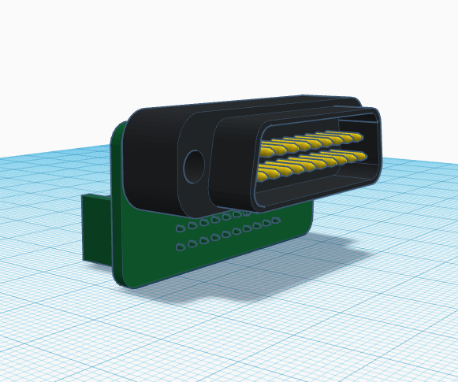
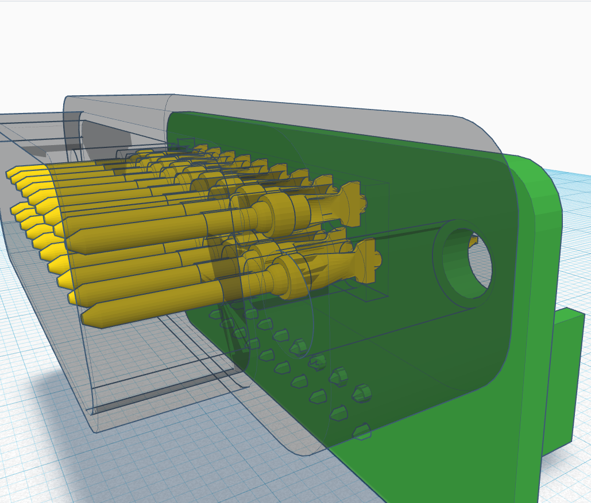
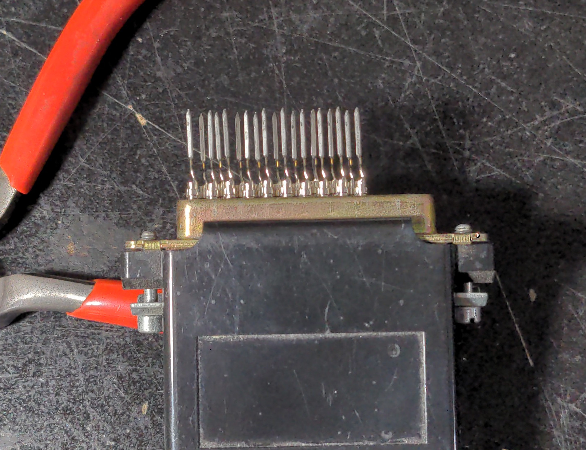

# Apple II DB-19 to IDC-20 Adapter

This adapter was created to be used with FujiNet but is likely usable for other Apple II DB-19 devices

# License

This project is released under the CERN OHL v2.0.

# Bill of Materials (BOM)

 * IDC-20 Socket
 * DB-19 Socket: 19pcs 5-745287-4

# Assembly Notes

Insert the 19 pins for the DB-19 socket into a DB-19 or DB-25 cable/adapter with the "fins" of the pins as shown below

The PCB is labeled "PIN SIDE" which is where the 3D printed connector goes. The unlabled side of the PCB is the solder side. Solder pin 1 and pin 19 first, ensuring the pins are straight/flush with the PCB then solder the remaining pins. Use side cutters to remove excess pins from the solder side.

Insert and solder the IDC-20 connector.

# 3D Printed DB-19 Connector

The connector should be printed with the PCB side down and supports are likely needed in the square cutout. The connector should fit snug on the pins with pressure.

The design was created with Tinkercad: https://www.tinkercad.com/things/jGl5ZyhV53l-apple-ii-db-19-to-idc-20-adapter

# Usage

The +12V and -12V lines are not connected by default to prevent accidental damage. If you need these lines connected, add a solder blob to the labeled pads.

The Drive 2 pin is broke out to a solder pad if needed

