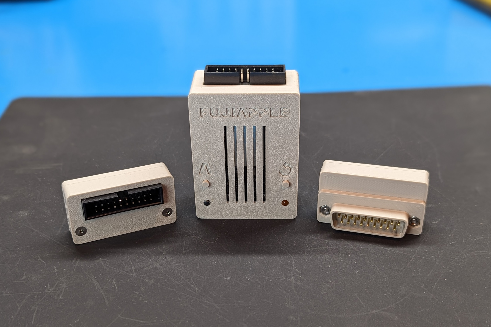
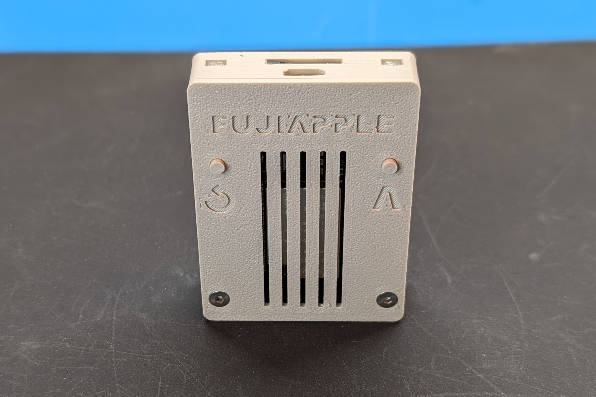
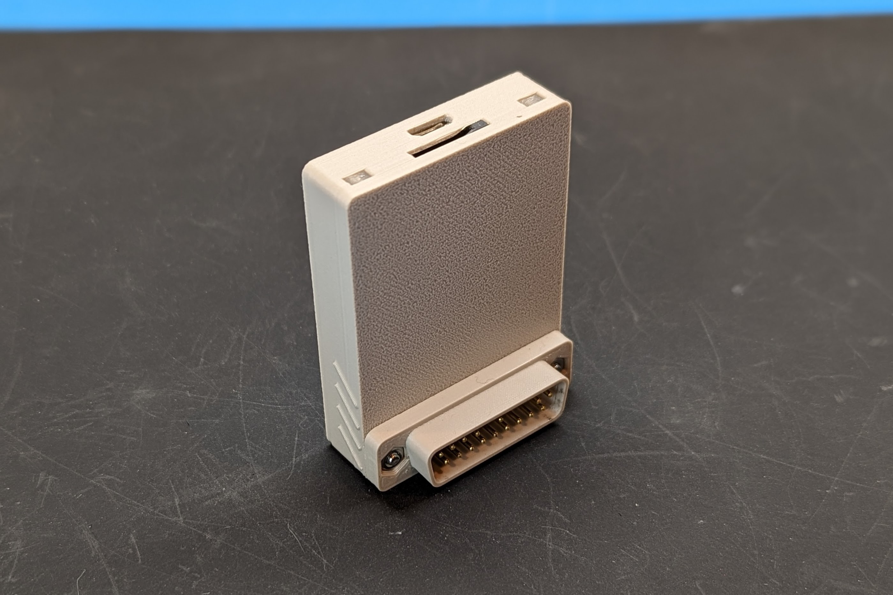
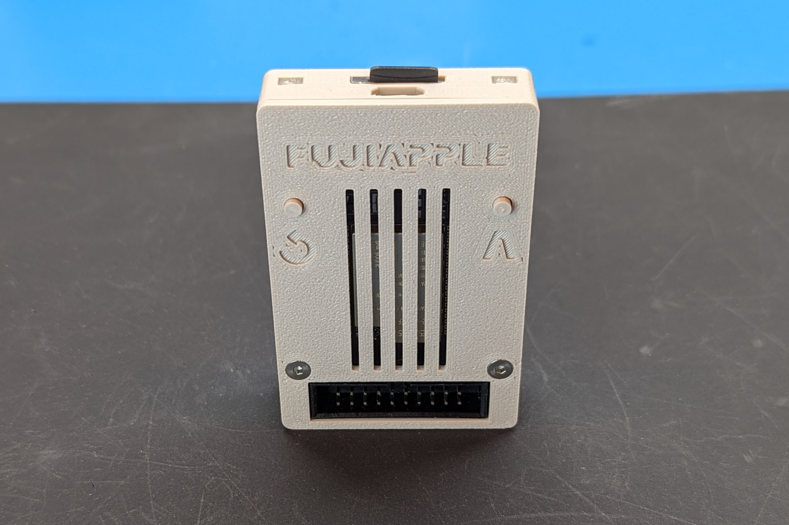

Hardware variants for the Apple II FujiNet platform (FujiApple).

# [Rev1.1](FujiApple-Rev1.1/README.md)

Works with both DB19 Apple II's (IIc, IIc+, IIgs, Laser 128) as well as IDC-20 connector disk cards (Disk II with [SoftSP](https://ct6502.org/product/softsp/), [SmartDisk II](https://github.com/btb/SmartDiskII)) in a II+ or IIe. Requires a male to female IDC-20 cable and the [DB-19M-Adapter-Female-Rev1](DB-19M-Adapter-Female-Rev1/README.md) adapter for DB19 operation. Designed primarily for commercial production or advanced hobbyists with lots of tiny SMD parts.

Rev1.1 improves on the Rev1 physical design by making the buttons more accessible when plugged into the DB19 port of a IIgs.  No electrical changes.

# [DevKit IDC-20 Rev1](FujiApple-DevKit-IDC-20-Rev1/README.md)

A more DIY friendly version of the Rev1 electrical design by using the ESP32-DEVKITC-VE board to reduce the BOM and make hand assembly easier.  Still all SMD compontents, but now 0805 package size or larger and the buffer chips are a TSSOP package for easier soldering.  Requires a female to female IDC-20 cable and the [DB-19M-Adapter-Male-Rev1](DB-19M-Adapter-Male-Rev1/README.md) adapter for DB19 operation.

# [DevKit SmartPort Rev1](FujiApple-DevKit-SmartPort-Rev1/README.md)

Same functionality as the DevKit IDC-20 Rev1 but has an integrated DB19 connector. The smallest FujiApple option for the Apple IIc, IIc+, IIgs, or Laser128 only.

# [DevKit Combo Rev1](FujiApple-DevKit-Combo-Rev1/README.md)

A mashup of the IDC-20 and SmartPort versions that includes both an integrated DB19 connector and an IDC-20 connector. Slightly larger than the SmartPort only option and for IDC-20 operation requires a female to female ICD-20 cable.

