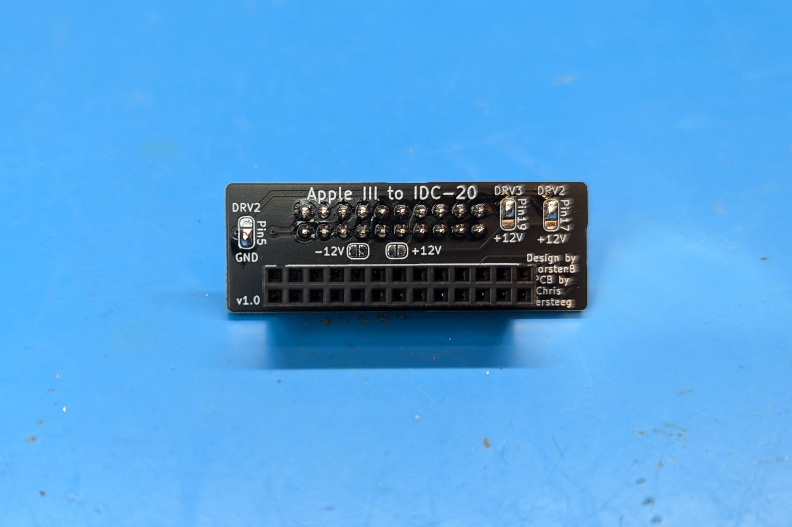

An IDC-26  to IDC-20 adapter allowing to to use yourApple II Fujinet, Floppy Emu, or Disk II drive on the external floppy port of an Apple III.  Based on the work of [ThorstenBr](https://github.com/ThorstenBr/AppleIII_diskII), but redesigned to plug directly into the external port and adds the option to route the drive 2 enable signal to pin 17, since Fujinet uses a different pin than the Floppy Emu which expects that signal on pin 5.

[Schematic](https://djtersteegc.github.io/fujinet-hardware/AppleIII/Schematic-IDC-26-Adapter-Rev1.pdf)

# BOM

[Interactive BOM](https://djtersteegc.github.io/fujinet-hardware/AppleIII/ibom-Rev1.html)

| Component                          | Qty  | Notes                                 | LCSC                                                         |
| ---------------------------------- | ---- | ------------------------------------- | ------------------------------------------------------------ |
| IDC-20 2.54mm 2x10 Male Box Header | 1    |                                       | [C429961](https://www.lcsc.com/product-detail/IDC-Connectors_JILN-321020SG0ABK00A01_C429961.html) |
| IDC-26 2.54mm 2x13 Female Header   | 1    |                                       | [C2834333](https://www.lcsc.com/product-detail/Female-Headers_TXGA-FFH25407-D26S1004K6K_C2834333.html) |
| 74LS32 SOP or SOIC                 | 1    | SOIC-14_3.9x8.7mm_P1.27mm             | [C521171](https://www.lcsc.com/product-detail/Logic-Gates_XINLUDA-XL74LS32_C521171.html) |
| 470R 0805 Resistor                 | 1    | Only needed for Floppy Emu mode build | [C17710](https://www.lcsc.com/product-detail/Chip-Resistor-Surface-Mount_UNI-ROYAL-Uniroyal-Elec-0805W8F4700T5E_C17710.html) |
| 3.3K 0805 Resistor                 | 3    |                                       | [C26010](https://www.lcsc.com/product-detail/Chip-Resistor-Surface-Mount_UNI-ROYAL-Uniroyal-Elec-0805W8F3301T5E_C26010.html) |
| 100nf 0805 Capacitor               | 1    |                                       | [C28233](https://www.lcsc.com/product-detail/Multilayer-Ceramic-Capacitors-MLCC-SMD-SMT_Samsung-Electro-Mechanics-CL21B104KCFNNNE_C28233.html) |

# Case

The case parts are designed to printed at a 0.2mm layer height and snaps together by inserting the wider tab first and then pushing down on the shorter tab side with the 72LS32 chip.  I found the tab on the lid broke off when using matte PLA with it's lower layer bond strength, but regular PLA or PLA+ (and probably PETG) worked fine and could be assembled and disassambled multiple times.  Your mileage may vary.

# Solder Jumpers

**-12V** - Routes -12V to pin 9

**12V** - Routes +12V to pins 13 and 15.  Also pin 17 and 19 depending on their jumper positions.

**PIN5** - Routes either the Drive2 signal or GND to Pin 5.  For use with the Floppy Emu, do NOT also then route Drive2 to Pin17.

**PIN17** - Routes either the Drive 2 signal or +12V to Pin 17. For use with the Fujinet, do NOT also then route Drive2 to Pin5.

**Pin 19** - Routes either the Drive 3 signal or +12V to Pin 19. For use with the Fujinet, experimental, not currently supported in hardware or firmware.

Here's a table of the different ways to can build this and what works.  If you route either Drive2 or Drive2 to pin 17 and 19, you must **NEVER** then attempt to plug an actual Disk II drive into this since they internally bridge +12V on all four pins and will backfeed that voltage into your Apple III drive enable lines.

| Mode       | -12V    | 12V     | Pin 5 | Pin 17 | Pin 19 |
| ---------- | ------- | ------- | ----- | ------ | ------ |
| Disk II    | Closed  | Closed  | GND   | +12V   | +12V   |
| Fujinet    | Open    | Open    | GND   | DRV2   | DRV3   |
| Floppy Emu | Closed* | Closed* | DRV2  | Open   | Open   |

| Mode       | Disk II                | Fujinet                   | Floppy Emu                |
| ---------- | ---------------------- | ------------------------- | ------------------------- |
| Disk II    | Yes                    | Drive 1 (as .d2) only     | Drive 1 (as .d2) only     |
| Fujinet    | **DANGER, DO NOT USE** | Drive 1 (.d2) and 2 (.d3) | Drive 1 (as .d2) only     |
| Floppy Emu | Yes                    | Drive 1 (as .d2) only     | Drive 1 (.d2) and 2 (.d3) |

*If you don't plan on using a Disk II, I would recommend NOT closing the two 12V jumpers for safety's sake, since these voltages are not needed by any of these modern drive emulators.

# Assembly

Assemble the SMD components and solder the jumpers as needed.  Note that the 74LS32 chip mounts upside down with pin 1 on the lower right. Then solder on the two IDC connectors, make sure to pay attention to which side of the board they go on.

I like to then add a label printed on a P-touch (0.23mm black on transparent tape) to denote the mode the adapter was built for.

