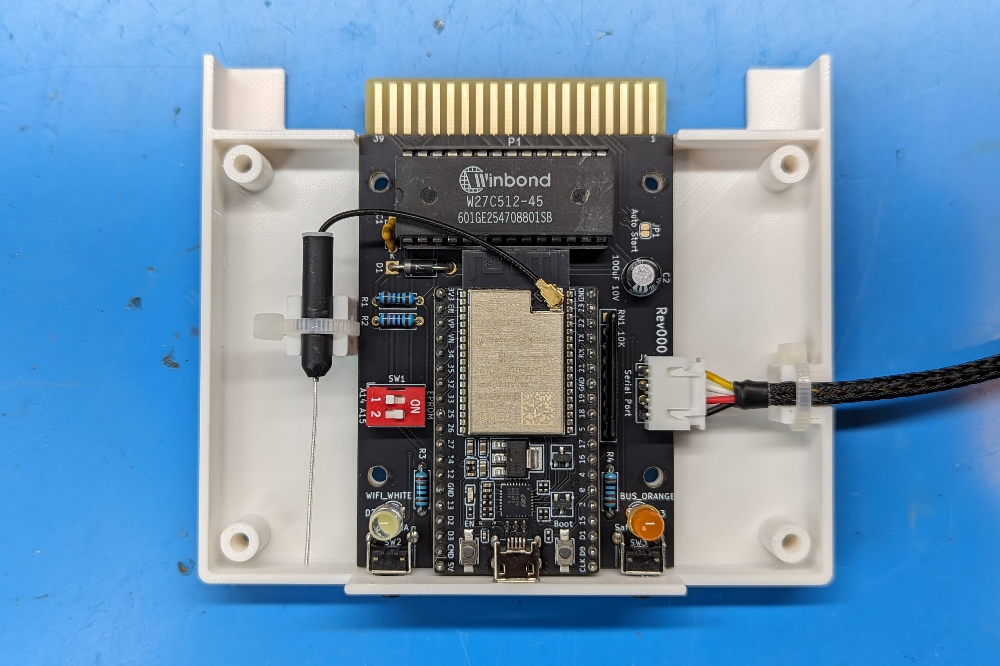
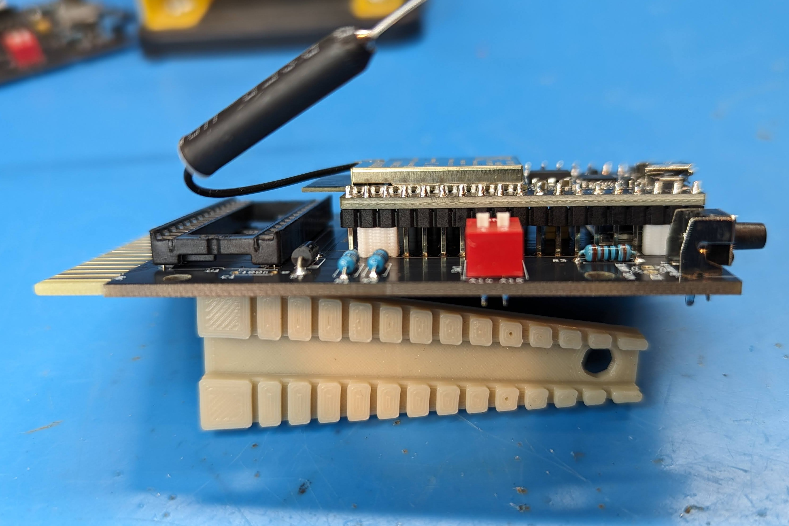
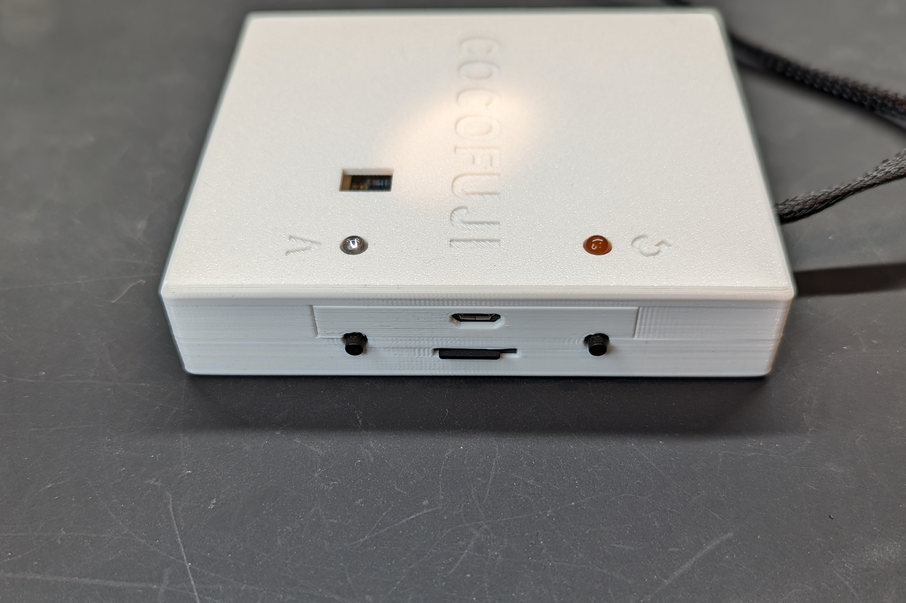
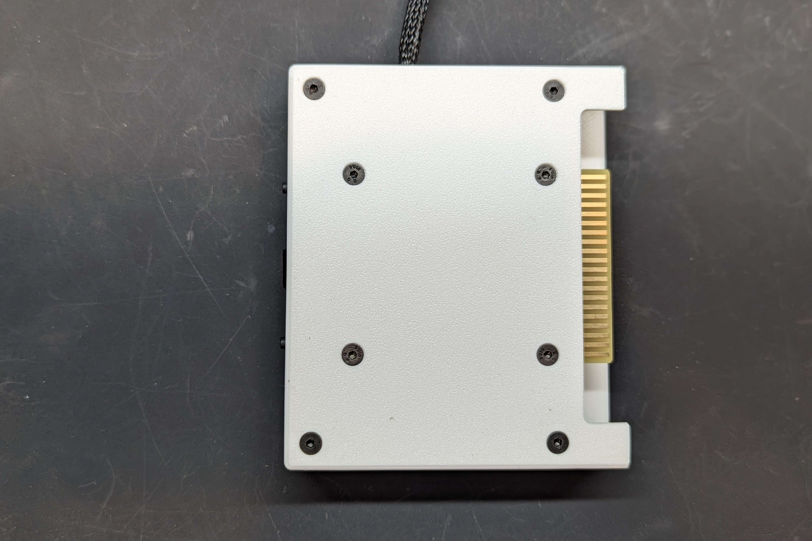
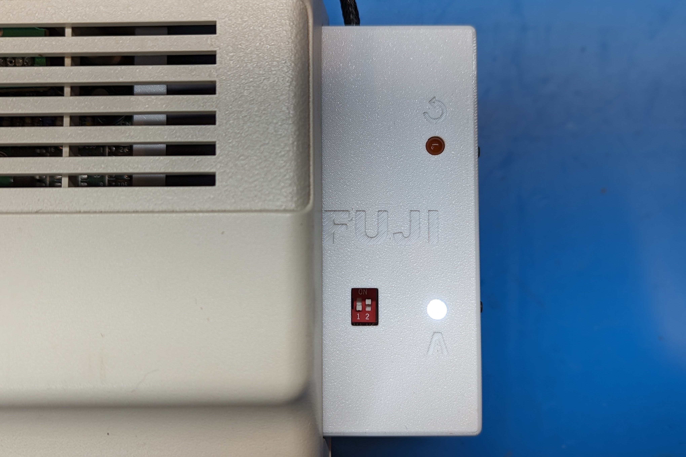
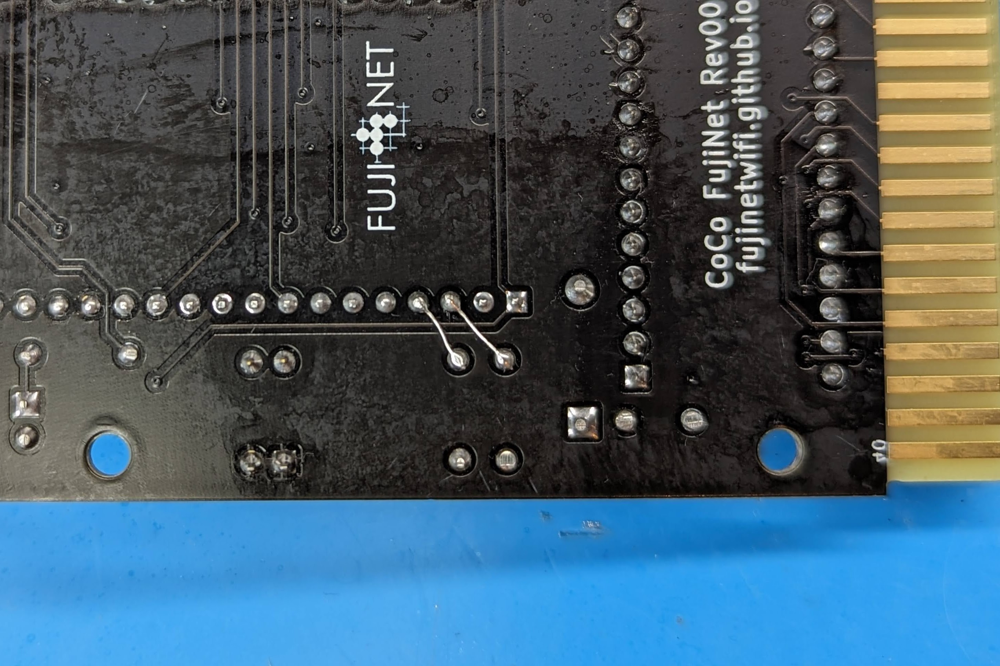
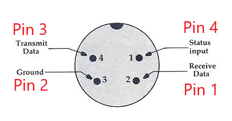
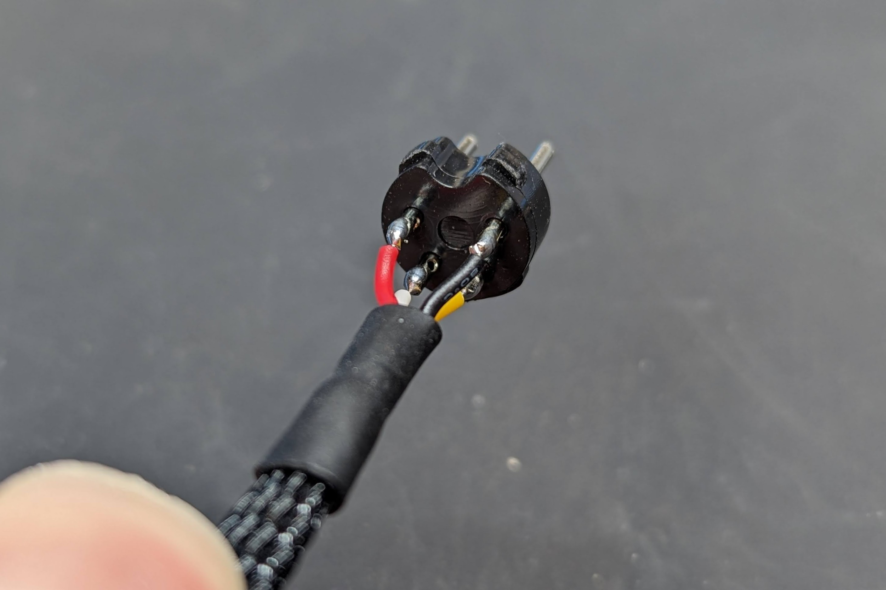
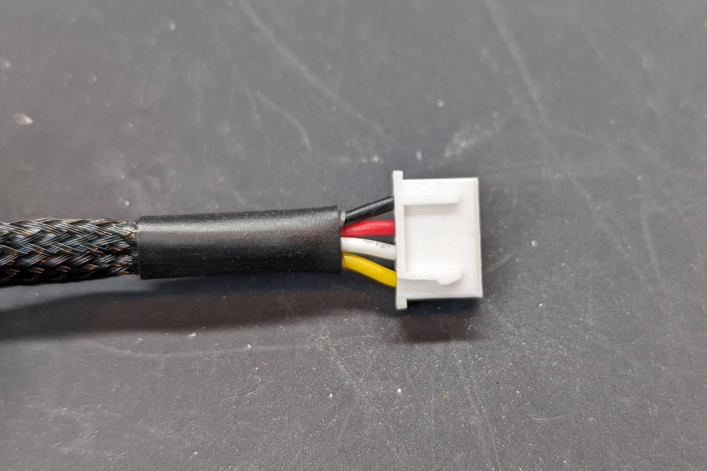
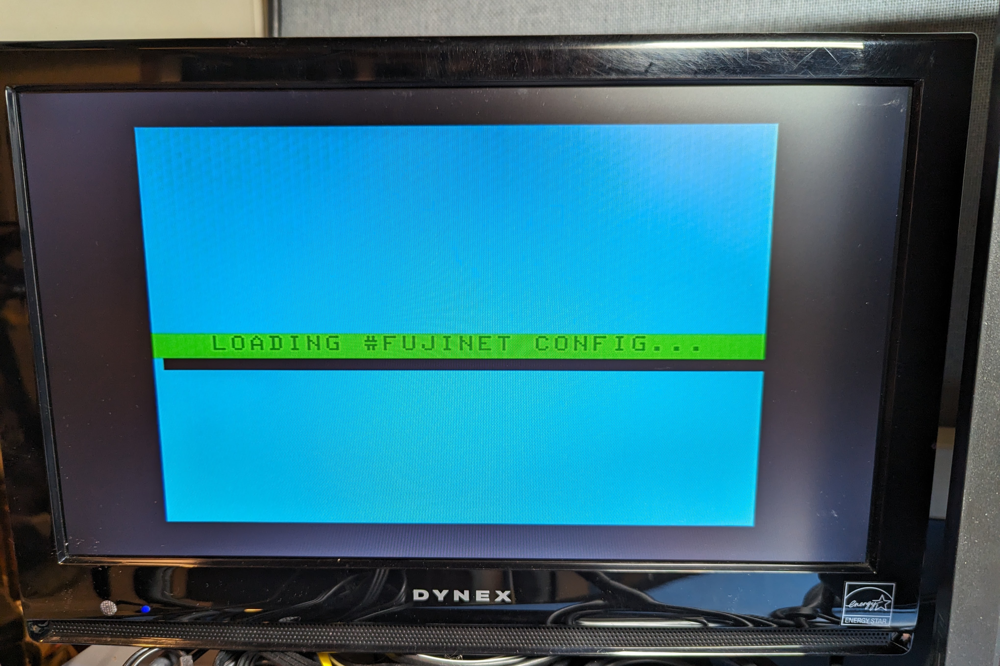

# Rev000

Rev000 does away with the tape circuit and moves to a ROM for bootstrapping HDB-DOS, similar to a "minimal" Rev00 build and bootstraping via a CocoSDC or other ROM cart.  Since it is now a cartridge format, you no longer need to power the ESP32 via USB, and instead it will normally take 5V from the cartridge port.  There is a diode so if you do want to power by USB for debug logging or other reasons it is safe to do so without backfeeding into the Coco.

With extra space in the cartridge case you can build with either the ESP32-DEVKITC-VE with an integrated antenna, or use a ESP32-DEVKITC-VIE with an external (included) antenna. In my testing the VIE version performed slightly better so I would recommend using it given the price is the same (at least in the US).

Schematic - https://djtersteegc.github.io/fujinet-hardware/Coco/CoCo-FujiNet-Rev000-Schematic.pdf

# BOM

Interactive BOM - https://djtersteegc.github.io/fujinet-hardware/Coco/ibom-Rev000.html

The MicroSD sockets are readily available from [AliExpress](https://www.aliexpress.us/item/3256801145064294.html), [Amazon](https://www.amazon.com/Spring-Loaded-Transflash-Memory-Socket/dp/B0CDC5Q1HF), eBay and other places, sometimes called _Push Push TransFlash Socket_.

The cable sockets on the board are the cheap [XH2.54 4p angle](https://www.aliexpress.us/item/2251832822174658.html) connectors.

The [3D printable case](CoCo-FujiNet-Rev000/3D/STL) is designed for 5mm LED's and 8mm stem length right angle tact switches. The "standard" FujiNet LED's colors are white for Wifi and orange for bus activity.

If you are a fan of AliExpress, there's a shopping list below.  Vendors come and go so links may go dead over time.  The ESP32 is actually cheaper on Amazon (with free Prime shipping). Can also be sourced from places like Digikey and Mouser, just make sure to pay attention to the suffix, models like the ESP32-DevKitC-32E will NOT work.

You'll also need components to build the DIN4 serial cable, so please read the Serial Cable section below to determine which parts you will need source for your Coco model.

| Component                               | Qty  | Notes                              | Link                                                         |
| --------------------------------------- | ---- | ---------------------------------- | ------------------------------------------------------------ |
| 100nF 50V Ceramic Capacitor             | 1    | 5mm Lead Spacing                   | [AliExpresss](https://www.aliexpress.us/item/3256805505361280.html) |
| 47uF 10V 3528 Tantalum Capacitor        | 1    | B Type Case (or smaller)           | [AliExpress](https://www.aliexpress.us/item/3256805505328370.html) |
| 100uF 10V Electrolytic Capacitor        | 1    | 6.3mm Diameter, 2.5mm Lead Spacing | [AliExpress](https://www.aliexpress.us/item/3256805505601375.html) |
| 10K 1/4w Resistor                       | 2    |                                    | [AliExpress](https://www.aliexpress.us/item/3256805483572082.html) |
| 1K 1/4w Resistor                        | 2    |                                    | [AliExpress](https://www.aliexpress.us/item/3256805483572082.html) |
| 10K 9 Pin Resistor Array                | 1    |                                    | [AliExpress](https://www.aliexpress.us/item/3256805495673085.html) |
| 1N5817 Diode                            | 1    |                                    | [AliExpress](https://www.aliexpress.us/item/3256805521351480.html) |
| 5mm LED (White)                         | 1    | Wifi                               | [AliExpress](https://www.aliexpress.us/item/3256805522045262.html) |
| 5mm LED (Orange)                        | 1    | Activity                           | [AliExpress](https://www.aliexpress.us/item/3256805522045262.html) |
| 27C512 Compatible EPROM or EEPROM       | 1    | Winbond W27C512 EEPROM             | [AliExpress](https://www.aliexpress.us/item/3256806559813313.html) |
| 28 Pin Wide DIP Socket                  | 1    |                                    | [AliExpress](https://www.aliexpress.us/item/3256805562135776.html) |
| 6mm x 6mm x 8mm Right Angle Tact Swtich | 2    |                                    | [AliExpress](https://www.aliexpress.us/item/2255800678062916.html) |
| 2 Way DIP Slide Switch                  | 1    |                                    | [AliExpress](https://www.aliexpress.us/item/3256801301494043.html) |
| microSD Socket                          | 1    | Push-Push TransFlash               | [AliExpress](https://www.aliexpress.us/item/3256801145064294.html) |
| 4P Right Angle XH2.54 Connector         | 1    | See below for other cable parts.   | [AliExpress](https://www.aliexpress.us/item/2251832822174658.html) |
| ESP32-DevkitC-VIE                       | 1    | ESP32-DevkitC-VE Also Works        | [Amazon](https://www.amazon.com/dp/B087TF2L27)               |

# Assembly

Unlike the previous revisions, you will need to solder the ESP32 onto the PCB since the cartridge format is to short to allow it to be mounted on standard 8.5mm tall female headers. Print four of the [4mm spacers](CoCo-FujiNet-Rev000/3D/STL/CoCo-FujiNet-Rev000-4mm-Spacer.stl) to mount the ESP32 elevated from the PCB to help improve the wifi performance if using the VE version with integrated antenna and provide more space between the SD slot and USB port.

The DIP switch allows for up to four 16K ROM images to loaded and selected on a 27c512 (or equivalent) EPROM. There is a precompiled image in the [ROM directory](ROM) with HDB-DOS DriveWire 3 images for the various Coco's from the hdbdos-snapshot20190324 as well as a diagnostics ROM from the Color Computer Archive.

| ROM                                       | Baud    | SW1-1 (A14) | SW1-2 (A15) |
| ----------------------------------------- | ------- | ----------- | ----------- |
| hdbdw3cc1.rom                             | 38,400  | ON          | ON          |
| hdbdw3cc2.rom                             | 57,600  | OFF         | ON          |
| hdbdw3cc3.rom                             | 115,200 | ON          | OFF         |
| Diagnostics v2.0 (1982) (26-3019) (Tandy) | N/A     | OFF         | OFF         |

The case is designed to be printed at a 0.2mm layer height.  Secure the PCB and two case halves with four M3x10mm to 20mm screws in the center four holes, and optionally four M3x16mm to 20mm screws in the outer four holes.  Overkill, but results in a very solid feeling cartridge with minimal gaps between the two halves.  There are two zip tie mounts for the serial cable and VIE external antenna.

# Rework to Set Baud Rate Based on ROM Image

Originally the firmware was hard coded to 57,600 baud to work with a Coco2 DriveWire HDB-DOS ROM.  Since we now have three selectable HDB-DOS ROM's each with a different baud rate for the serial port, wouldn't it be nice for that to change based on the image selected without having to flash new firmware?  Simply solder two jumper wires between the A14/A15 dip switch and pins 3/4 on the ESP32 and the switch positions will now be detected at startup and the correct baud rate set based on the ROM table above.

# Building the Serial Cable

If you have a later Coco2 or Coco3 with the serial port close to the cartridge port, you can buy some 300mm [prewired female connectors](https://www.aliexpress.us/item/2255801048702387.html) and [4mm nylon sleaving](https://www.aliexpress.us/item/2251832733475111.html) for cable making.  A Coco1 and early Coco2's with the serial port further from the cartridge port requires a longer 18" cable to reach. [Four core 26AWG UL2547 cable](https://www.aliexpress.us/item/3256801872028158.html) works well for this with some [XH2.54 4P connectors and terminals](https://www.aliexpress.us/item/2251832815492773.html). For either option you'll need a [DIN4 male](https://www.aliexpress.us/item/3256804124853512.html) plug for the serial port.

The DIN 4 serial cable pinout (looking at it from the backside of the connector) with the corresponding XH connector pins (they are also marked on the PCB).

And some completed cable pics:

# Flashing Your FujiNet

At this stage there is no official release of the Coco firmware in the [Fujinet Flasher](https://fujinet.online/download/).  But you can still use it to easily flash a precompile version (check the Discord), or you can [compile one yourself](https://github.com/FujiNetWIFI/fujinet-firmware/wiki/Board-Bring-Up-Software).

# Usage

Insert into cart slot and plug attached cable into your Coco's serial port.

Assuming the FujiNet device is correctly flashed, it should launch into the Fujinet config app on power up.

