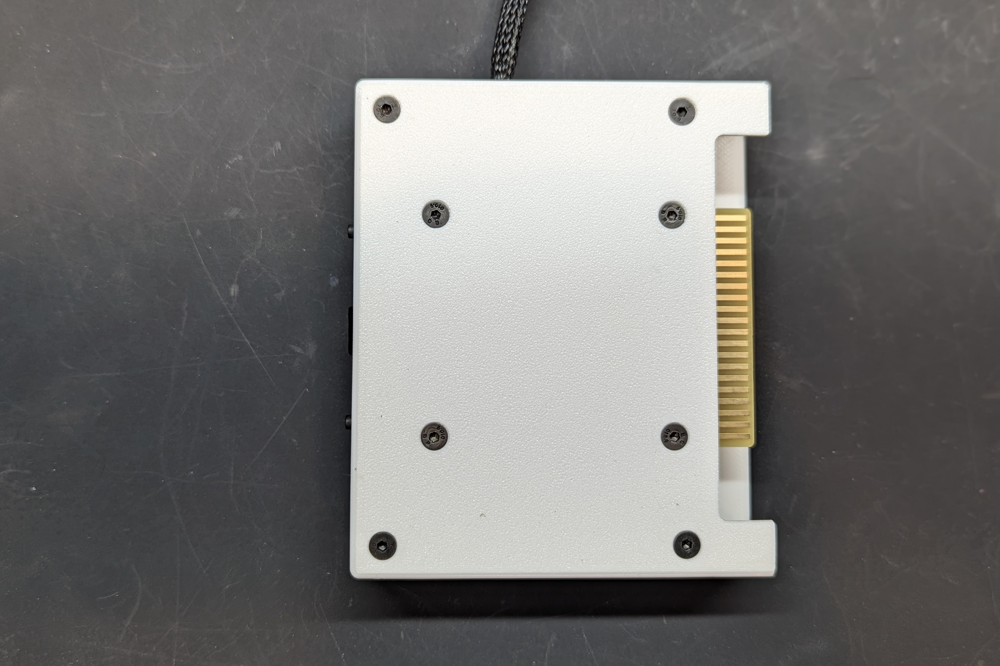
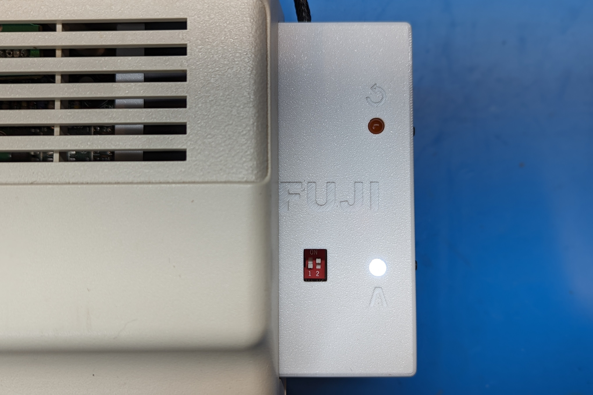
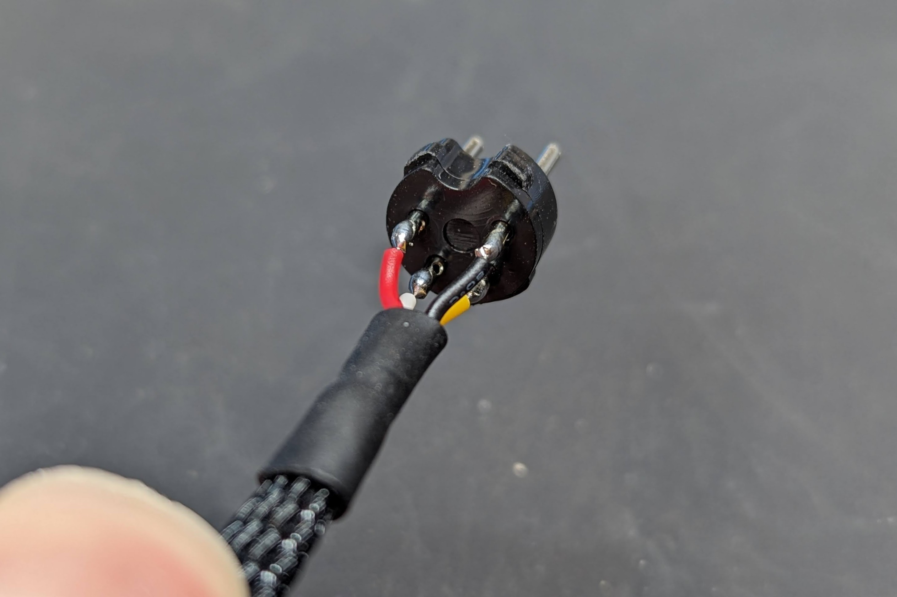

# Rev000

Rev000 does away with the tape circuit and moves to a ROM for bootstrapping HDB-DOS, similar to a "minimal" Rev00 build and bootstraping via a CocoSDC or other ROM cart.  Since it is now a cartridge format, you no longer need to power the ESP32 via USB, and instead it will normally take 5V from the cartridge port.  There is a diode so if you do want to power by USB for debug logging or other reasons it is safe to do so without backfeeding into the Coco.

With extra space in the cartridge case you can build with either the ESP32-DEVKITC-VE with an integrated antenna, or use a ESP32-DEVKITC-VIE with an external (included) antenna. In my testing the VIE version performed slightly better so I would recommend using it given the price is the same (at least in the US).

Schematic - https://djtersteegc.github.io/fujinet-hardware/Coco/CoCo-FujiNet-Rev000-Schematic.pdf

Interactive BOM - https://djtersteegc.github.io/fujinet-hardware/Coco/ibom-Rev000.html

You'll need 8.5mm high [2.54mm female header strips](https://www.aliexpress.us/item/2251832416528370.html) to mount the ESP32.  Buy the 1x40 versions and cut to length.

MicroSD socket footprint is the common [Chinese push-push version](https://www.aliexpress.us/item/2251832613969983.html) used on all the FujiNet's to date.

The cable sockets on the board are the cheap [XH2.54 4p angle](https://www.aliexpress.us/item/2251832735749189.html) connectors.

The [3D printable case](CoCo-FujiNet-Rev000/3D/STL) is designed for 5mm LED's and 8mm right angle tact switches.

Unlike the previous revisions, you will need to solder the ESP32 onto the PCB since the cartridge format is to short to allow it to be mounted on standard 8.5mm tall female headers. Print four of the [4mm spacers](CoCo-FujiNet-Rev000/3D/STL/CoCo-FujiNet-Rev000-4mm-Spacer.stl) to mount the ESP32 elevated from the PCB to help improve the wifi performance if using the VE version with integrated antenna and provide more space between the SD slot and USB port.

The DIP switch allows for up to four 16K ROM images to loaded and selected on a 27c512 (or equivalent) EPROM. There is a precompiled image in the [ROM directory](ROM) with HDB-DOS DriveWire 3 images for the various Coco's from the hdbdos-snapshot20190324 as well as a diagnostics ROM from the Color Computer Archive.

| ROM                                       | SW1-1 (A14) | SW1-2 (A15) |
| ----------------------------------------- | ----------- | ----------- |
| hdbdw3cc1.rom                             | ON          | ON          |
| hdbdw3cc2.rom                             | OFF         | ON          |
| hdbdw3cc3.rom                             | ON          | OFF         |
| Diagnostics v2.0 (1982) (26-3019) (Tandy) | OFF         | OFF         |

The case is designed to be printed at a 0.2mm layer height.  Secure the PCB and two case halves with four M3x10mm to 20mm screws in the center four holes, and optionally four M3x16mm to 20mm screws in the outer four holes.  Overkill, but results in a very solid feeling cartridge with minimal gaps between the two halves.  There are two zip tie mounts for the serial cable and VIE external antenna.

# Building the Serial Cable

If you have no plans to use with a Coco1, you can buy some 300mm [prewired female connectors](https://www.aliexpress.us/item/2255801048702387.html) and [4mm nylon sleaving](https://www.aliexpress.us/item/2251832733475111.html) for cable making.  A Coco1 requires a longer 18" cable to reach from the cartridge port to the serial port. [Four core 26AWG UL2547 cable](https://www.aliexpress.us/item/3256801872028158.html) works well for this. You'll need a [DIN4 male](https://www.aliexpress.us/item/3256804124853512.html) plug for the serial port.

The DIN 4 serial cable pinout (looking at it from the backside of the connector) with the corresponding XH connector pins (they are also marked on the PCB).

And some completed cable pics:

# Flashing Your FujiNet

At this stage there is no official release of the Coco firmware in the [Fujinet Flasher](https://fujinet.online/download/).  But you can still use it to easily flash a precompile version (check the Discord), or you can [compile one yourself](https://github.com/FujiNetWIFI/fujinet-firmware/wiki/Board-Bring-Up-Software).

# Usage

Rev000 - Insert into cart slot and plug attached cable into your Coco's serial port.

Assuming the FujiNet device (and CocoSDC if needed) is correctly flashed, it should launch into the Fujinet config app on power up.

