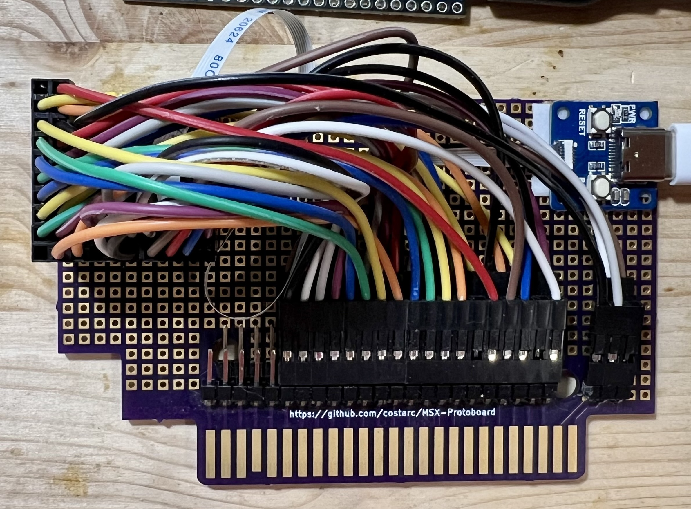
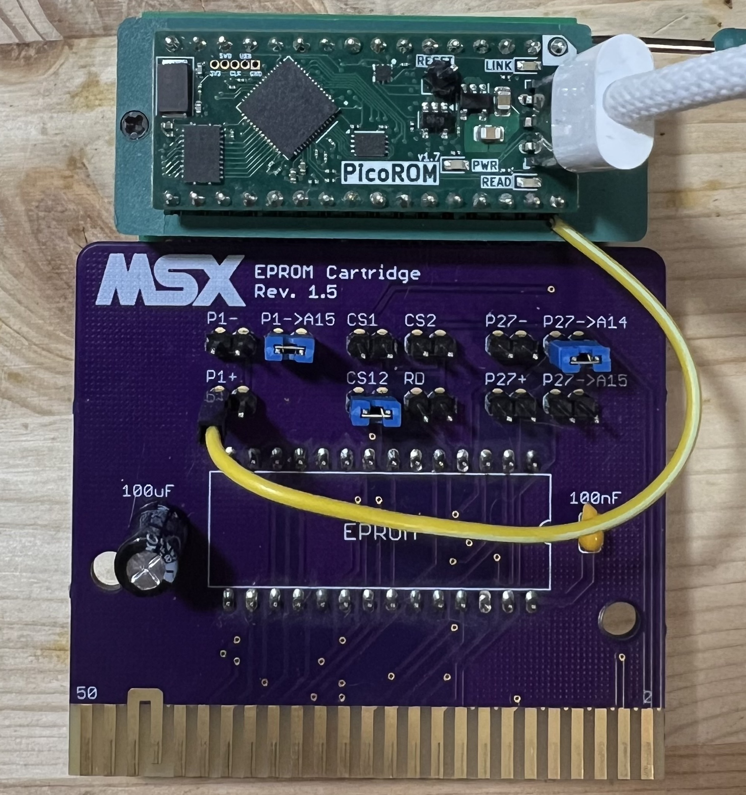

# MSX

# Prototype #2

Uses an RP2350B dev board connected to a cartridge.

[Schematic - KiCad](Prototype-2)

[Schematic - PDF](../docs/MSX/MSX-Prototype-2.pdf)

[Waveshare Core2350B](https://www.waveshare.com/Core2350B.htm)

# Prototype #1
Used an RP2040-based PicoROM connected to a cartridge.

